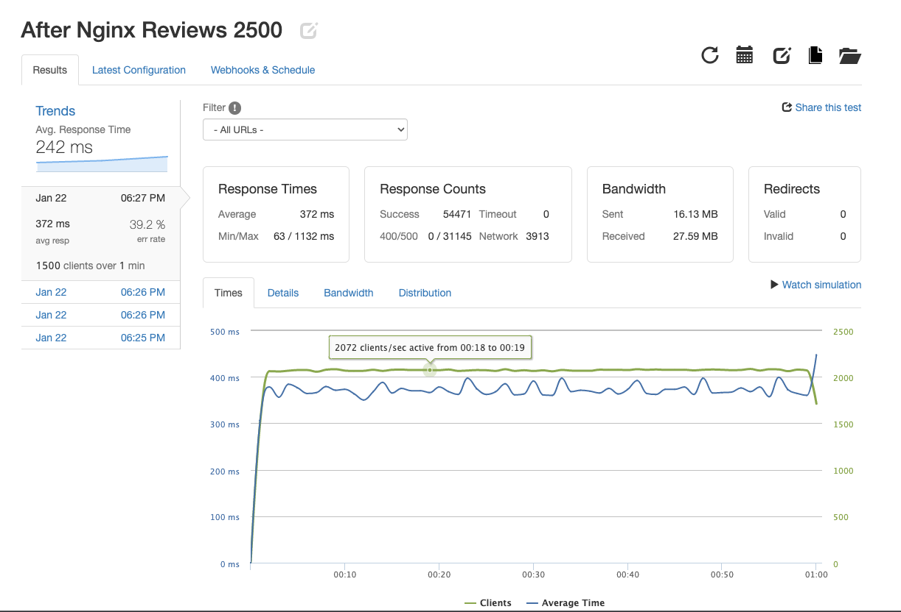

# Project-Catwalk-Ratings-API
For this group project at HackReactor, we were tasked to create and optimize an API server that would replace the API that is currently supporting our
Front-End Project Catwalk application.

Building out a API server for the reviews&ratings module of a previous Front-End-Project at Hackreactor.

