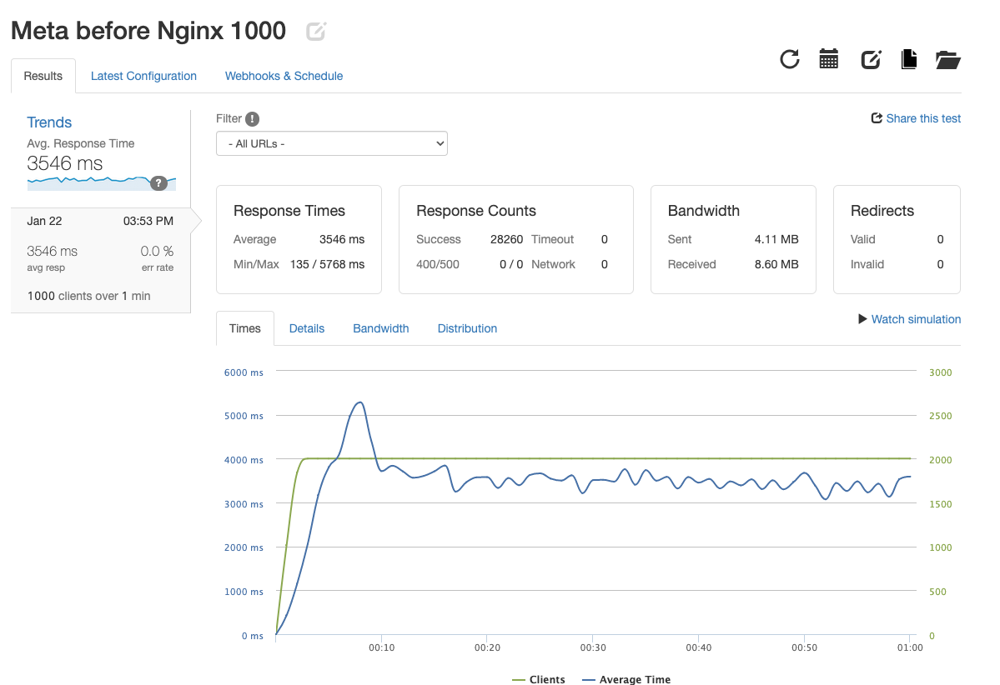
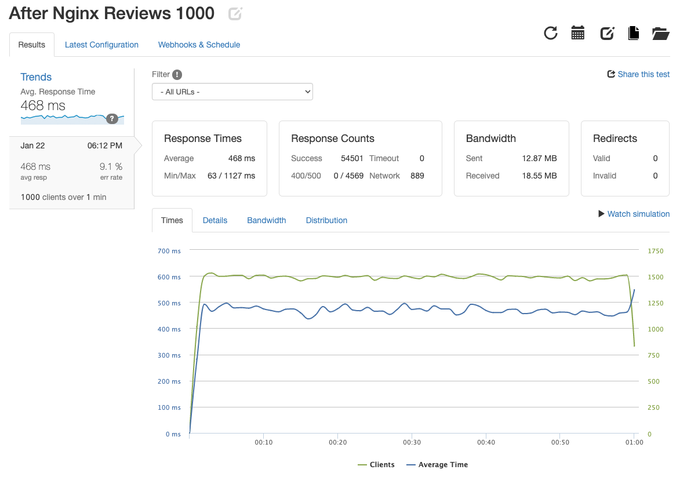
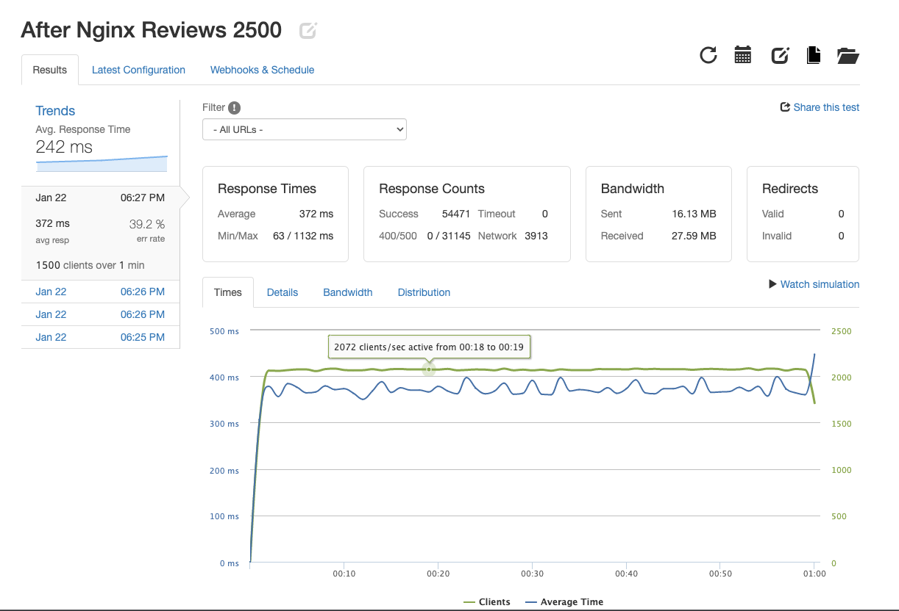

# Project-Catwalk-Ratings-API
For this group project at HackReactor, we were tasked to create and optimize an API server that would replace the API that is currently supporting our
Front-End Project Catwalk application.

Building out a API server for the reviews&ratings module of a previous Front-End-Project at Hackreactor.

Database: MongoDB, deployed AWS t3.Medium
NGINX Server: deployed on AWS t2.Micro
Node Server 1: Express.js, deployed on AWS t2.Micro
Node Server 2: Express.js, deployed on AWS t2.Micro

Before setting up NGINX and second server to handle more requests:
The API was able to handle 28260 requests via 1000 clients over 1 min with an avg. response time of 3546ms

After setting up NGINX and second server to handle more requests:
The API was able to handle 54501 requests via 1000 clients over 1 min with an avg. response time of 468ms

API was pushed to handle 54471 requests via 1500 clients over 1 min with an avg. response time of 372ms, but an increased error rate.

